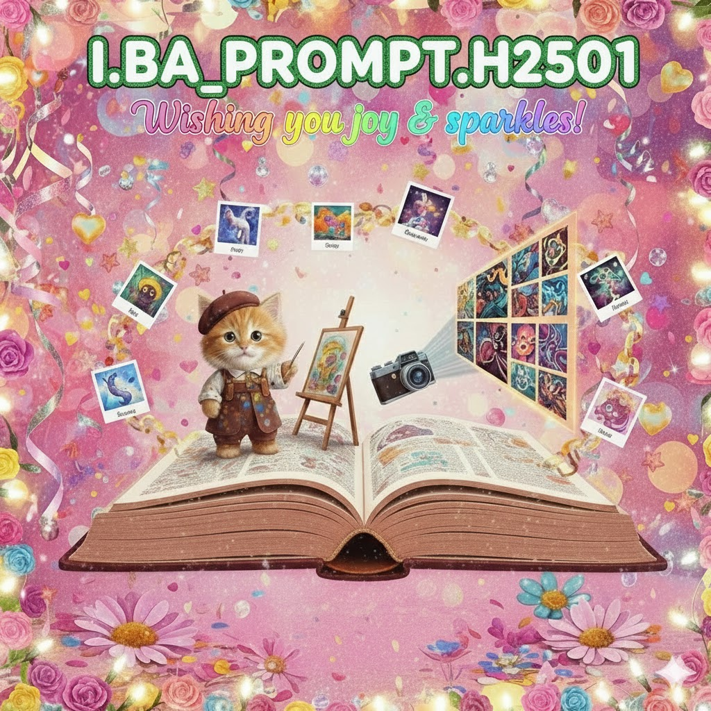

# 📘 Prompt Engineering (PROMPT)

This repository contains materials for the **Prompt Engineering** class. It focuses on practical skills for generating text, images, video, and sound using AI tools — with a strong emphasis on creative experimentation and critical reflection.

## 📚 Table of Contents

1. [Overview](#-overview)
2. [Competencies](#-competencies)
3. Session Summaries
   - [Day 01 — Prompting for Image & Video Generation](#️-day-01--prompting-for-image--video-generation)
   - [Day 02 — Prompting for Music & Sound Generation](#-day-02--prompting-for-music--sound-generation)
   - [Day 03 — VibeCoding & Video Interpretation](#-day-03--vibecoding--video-interpretation)
4. [Tools & Resources](#️-tools--resources)
5. [Ethics & Reflection](#️-ethics--reflection)

---

## 🧭 Overview

**Prompt Engineering (PROMPT)** equips students with hands-on prompting techniques for different modalities: text, image, music, and video generation. Emphasis is placed on both _creative craft_ and _responsible use_.

Each week includes mini-projects that simulate real-world creative workflows, supported by ethical discussion and critical reflection.

---

## 🧩 Competencies

**Professional**

- Design effective prompts for diverse AI tools and contexts.
- Adapt prompts to different models and use cases.
- Understand the limits and appropriate use of generative systems.
- Recognize privacy, security, and IP risks when using AI.

**Methodological**

- Test, compare, and refine prompts systematically.
- Analyze structure and wording to improve outputs.

**Personal**

- Engage critically and creatively with AI tools.
- Communicate transparently about AI-assisted work.
- Reflect on ethical and societal implications.

---

## [🖼️ Day 01 — Prompting for Image & Video Generation](./day01.md)

**Focus:** Understanding visual generation models and mastering descriptive, stylistic prompting through the _Artistic Telephone_ game.

### Learning Goals

- Understand how text-to-image/video models interpret language.
- Construct scene-based prompts that define subject, style, and mood.
- Observe interpretation drift and prompt clarity in creative chains.

### Key Activities

- Model demo & style comparison (Replicate / SDXL / Pika Labs)
- Crafting effective art-style prompts
- Writing full visual scene descriptions
- _Artistic Telephone_ collaborative exercise

---

## [🎵 Day 02 — Prompting for Music & Sound Generation](./day02.md)

**Focus:** Exploring AI music and sound generation — prompting for genre, tempo, and mood across different models through the _PromptVision_ contest.

### Learning Goals

- Understand how AI systems synthesize and remix audio.
- Write structured prompts for mood, genre, and tempo.
- Evaluate and compare audio outputs for coherence and style.
- Collaborate in creative “AI Eurovision”-style performance.

---

## [💫 Day 03 — VibeCoding & Video Interpretation](./day03.md)

**Focus:** Translating aesthetic “vibes” into generative logic using **p5.js** and interpreting those human-coded rhythms through **AI video generation** inspired by Rafael Lozano-Hemmer’s _Internet_.

### Learning Goals

- Express mood, rhythm, and motion through parameter-based “vibe coding.”
- Understand how procedural systems embody aesthetic language.
- Generate visual outputs and transform them into AI video interpretations.
- Compare human vs. AI perception of visual rhythm and motion.

### Key Activities

- VibeCoding exercise in p5.js (no prior coding required)
- Group reinterpretations of _Internet_
- Frame capture and AI video generation on Replicate
- Reflection on motion, authorship, and interpretation drift

---

## 🛠️ Tools & Resources

- **Image Generation:** Stable Diffusion XL, Kandinsky 3, PixArt, DALL·E 3, Midjourney  
- **Video Generation:** Runway ML, Pika Labs, Kaiber, Sora (conceptual), Replicate video models  
- **Audio Generation:** MusicLM, AudioLDM, Mubert, Suno.ai  
- **Creative Coding:** [p5.js](https://p5js.org) (browser editor)  
- **Experimentation Platform:** [Replicate](https://replicate.com)  
- **Workflow UIs:** Automatic1111, ComfyUI  

---

## ⚖️ Ethics & Reflection

Topics covered across sessions:

- Copyright and dataset provenance  
- Bias, representation, and inclusivity in generative media  
- Disclosure and transparency in AI-assisted work  
- Synthetic reality, interpretation, and creative responsibility
